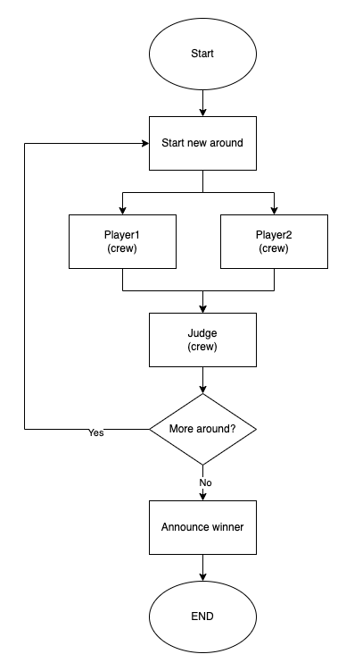

# Rock Paper Scissors (rps) Agent Game

## 1. Introduction
Have you ever wondered which AI model is the best Rock-Paper-Scissors player? This project will help you find out!

This project demonstrates how to use the [CrewAI](https://www.crewai.com/) and [LangGraph](https://www.langchain.com/langgraph) to build multi-agent systems. It runs fully automated Rock-Paper-Scissors games, where multiple AI agents play against each other. Each AI agent is powered by a different Large Language Model (LLM), allowing you to run games such as OpenAI vs. Meta Llama, or Llama vs. Claude. There are also AI judge agents to compare player agents’ moves and decide the winner.

### Features
- **Multi-Agent System**: Simulate games with multiple AI agents.
- **Diverse AI Models**: Compare different LLMs like OpenAI, Meta Llama, and Claude.
- **Automated Judging**: AI judge agents determine the winner of each round.

## 2. Workflow
It runs multiple rounds of Rock-Paper-Scissors games. 
- In each round, two player agents make their moves independently and in parallel. They have access to the history of previous rounds, allowing them to analyze patterns and decide on the best move.
- After the players make their moves, a judge agent determines the winner of the round.
- The system checks if the criteria for determining the final winner have been met (e.g., reaching the specified number of rounds, or a player winning 3 out of 5 rounds).
	- **Criteria Not Met**: If the criteria are not met, another round begins.
	- **If the criteria are met**: The final winner is announced, and a post-game analysis is performed.



### 2.1. Building blocks
- CrewAI: For defining the agents and tasks
- LangGraph: For defining the workflow 
- Amazon Bedrock: For LLM hosting
- LangSmith: For debugging and tracking

## 3. Demo: The ability of Claude 3 Sonnet to play Rock Paper Scissors games
### 3.1 Claude 3 Sonnet vs Doreamen (AI Agent vs a dummy agent)

> Noticeable patterns (from post-game analysis):
>    - Doraemon consistently played Rock in all 20 rounds, showing no variation in strategy.
>    - claude-3-sonnet started with Rock for the first two rounds, then switched to a pattern of mostly playing Paper, with one instance of Scissors in round 4.
>    - After round 5, claude-3-sonnet exclusively played Paper for the remaining rounds, likely adapting to Doraemon's consistent Rock strategy.
>    - The game shows a clear example of one player (claude-3-sonnet) adapting to the other player's (Doraemon) predictable strategy, resulting in a dominant performance.
> 

And we know exactly why Doraemon consistently played Rock :)


### 3.2 Claude 3 Sonnet vs Llama3 (AI Agent vs another AI agent)

> Noticeable Patterns (from post-game analysis):
>
> llama3-8b-instruct:
>    - Shows a strong preference for Paper (10 times) and Rock (7 times), rarely choosing Scissors (only 3 times).
>    - Often repeats the same move for several consecutive rounds.
>
> claude-3-sonnet:
>    - Has a very strong preference for Scissors (13 times out of 20 rounds).
>    - Rarely chooses Rock (only twice in the entire game).
>    - Seems to adapt its strategy to counter llama3-8b-instruct's frequent use of Paper.
>
> Overall game pattern:
>    - There's a high frequency of Paper vs Scissors matchups (9 times), which always favors claude-3-sonnet.
>    - The game becomes somewhat predictable in later rounds, with llama3-8b-instruct often playing Paper and claude-3-sonnet countering with Scissors.
>

## 4. Post-game analysis between llama3-8b-instruct and claude-3-sonnet
I have ran 2 games that llama3-8b-instruct play against claude-3-sonnet.

claude-3-sonnet won both games. 

The game with 10 rounds result can be found at here [doc/sample_state.json](doc/sample_state.json)

The final announcement and post-game analysis examples are:

1. A game with 10 rounds (finished in 89.63 sec)
```
After reviewing the game history, here are my findings:

1. Judge Result Accuracy:
   There is one minor inconsistency in the judge's result terminology. In round 1, the result is listed as "tie" (lowercase), while in other tie rounds (2, 4, and 8), it's listed as "Tie" (capitalized). This doesn't affect the outcome but is worth noting for consistency.

   In round 10, the judge's result format is different from the rest, stating "Player 1, 'llama3-8b-instruct'" instead of just the player name. However, the winner is correctly identified.

2. Game Winner Determination:
   Based on the round-by-round results:
   - claude-3-sonnet won 5 rounds (3, 5, 6, 7, 9)
   - llama3-8b-instruct won 1 round (10)
   - 4 rounds were ties (1, 2, 4, 8)

   Therefore, the overall winner of the game is claude-3-sonnet.

3. Noticeable Patterns:
   a. llama3-8b-instruct:
      - Started with Rock for the first three rounds
      - Showed a preference for Paper, playing it 4 times out of 10 rounds
      - Only played Scissors twice, in rounds 6 and 10

   b. claude-3-sonnet:
      - Showed a strong preference for Paper, playing it 5 times out of 10 rounds
      - Played Rock only twice, in the first two rounds
      - Seemed to adapt its strategy, not repeating the same move more than twice in a row

   c. General Observations:
      - The game had a high number of ties (4 out of 10 rounds)
      - claude-3-sonnet seemed to have a more varied and adaptive strategy compared to llama3-8b-instruct
      - llama3-8b-instruct's moves were more predictable, which might have contributed to its losses

In conclusion, claude-3-sonnet demonstrated a superior strategy and adaptability, leading to its victory in the game.
```

2. a game with 20 rounds (finished in 160 sec)
```
After reviewing the game history, here are my findings:

1. Judge Result Accuracy:
The judge's results appear to be correct for all rounds. There are no noticeable mistakes in the outcomes based on the players' moves.

2. Determining the Winner:
To determine the overall winner, I'll count the wins for each player:

llama3-8b-instruct wins: 5 (rounds 4, 7, 14, 16, 17)
claude-3-sonnet wins: 7 (rounds 2, 5, 10, 11, 13, 15, 20)
Ties: 8 (rounds 1, 3, 6, 8, 12, 18, 19)

The winner of the game is claude-3-sonnet with 7 wins compared to llama3-8b-instruct's 5 wins.

3. Noticeable Patterns:

a) llama3-8b-instruct:
- Shows a strong preference for Scissors, playing it 10 out of 20 rounds (50% of the time).
- Plays Rock 4 times and Paper 6 times.
- Has a streak of playing Scissors for 5 consecutive rounds (13-17).

b) claude-3-sonnet:
- More balanced play, with Rock 8 times, Paper 7 times, and Scissors 5 times.
- Shows adaptability, often changing moves between rounds.
- Has a small streak of playing Rock for 3 consecutive rounds (18-20).

c) General patterns:
- The game has a high number of ties (8 out of 20 rounds, or 40%).
- There are several instances where both players repeat their previous move, leading to either repeated outcomes or a change in winner.
- The last two rounds ended in ties with both players choosing Rock, suggesting possible conservative play towards the end of the game.

In conclusion, claude-3-sonnet's more balanced and adaptable strategy seems to have given it an edge in this game, while llama3-8b-instruct's heavy reliance on Scissors may have made its moves more predictable.
```

## 5. Run the project
```bash
python -m venv .venv
pip install -r requirements.txt 

# make sure .env file has correct API keys

python main.py #it will save the game result to game_result_{timestamp}.txt
```

## License
This project is released under the MIT License.
